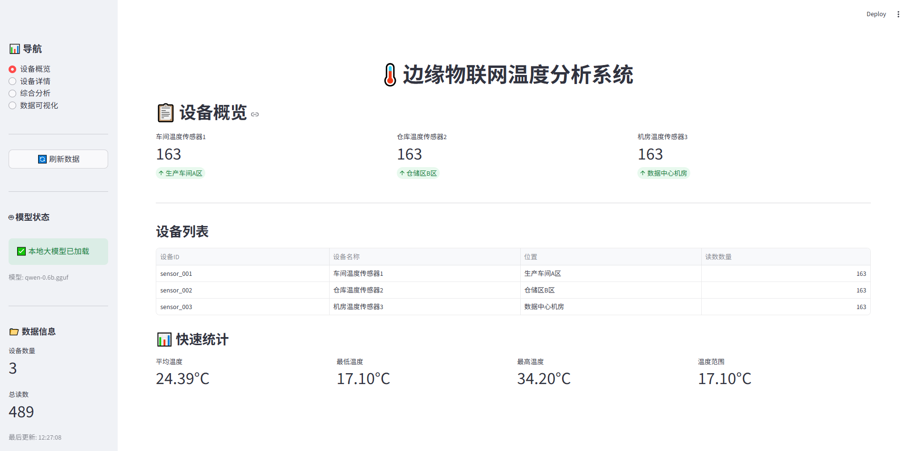
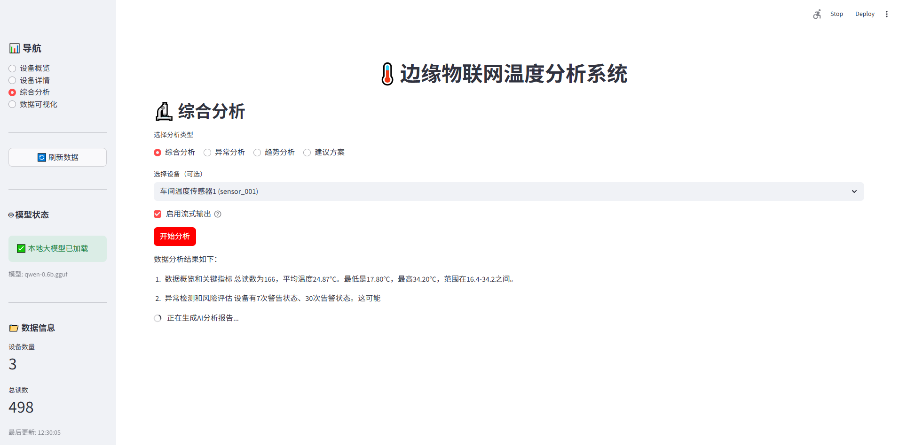
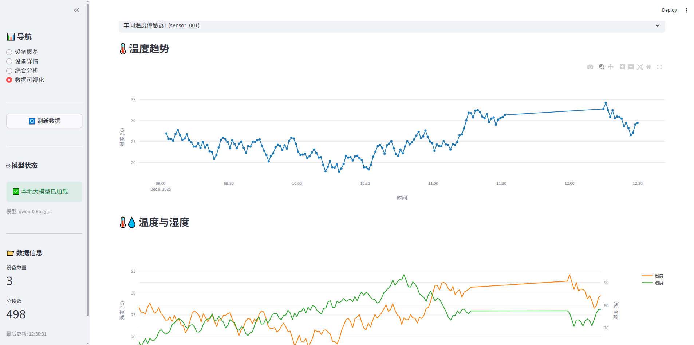

# 🌡️ Edge-LLM: Edge IoT Temperature Analysis System

> **GitHub**: [https://github.com/jonehoo/Edge-LLM](https://github.com/jonehoo/Edge-LLM)

<div align="center">

[](https://www.python.org/)
[](LICENSE)
[](https://streamlit.io/)

**Intelligent Temperature Data Analysis System Based on Large Language Models**

[Features](#-features) • [Quick Start](#-quick-start) • [Documentation](#-documentation) • [Contributing](#-contributing)

[中文](README.md) | [English](README_EN.md)

</div>

<div align="center">
  
  <p><em>Edge-LLM Main Interface Preview</em></p>
</div>

---

## 📖 Project Introduction

Edge-LLM is an intelligent temperature data analysis system for edge IoT devices based on large language models. It integrates local LLMs and OpenAI API, providing intelligent temperature data analysis and visualization capabilities.

### ✨ Key Highlights

- 🤖 **Dual Model Support**: Supports local LLMs (llama-cpp-python) and OpenAI API with flexible switching
- 💾 **Multiple Data Sources**: Supports JSON files and MySQL database with automatic reconnection
- 📊 **Intelligent Analysis**: AI-driven temperature data analysis with automatic professional report generation
- 🎨 **Visualization Interface**: Modern web interface based on Streamlit
- 🔍 **Anomaly Detection**: Intelligent anomaly detection based on statistical methods
- 📈 **Trend Analysis**: Multi-dimensional trend analysis and prediction

## 🚀 Features

### Data Processing
- ✅ JSON file data loading
- ✅ MySQL database support (auto-reconnect)
- ✅ Device data query and statistics
- ✅ Time range filtering
- ✅ Data caching mechanism

### Data Analysis
- ✅ Anomaly temperature detection (Z-score method)
- ✅ Trend analysis (moving average, volatility analysis)
- ✅ Statistical analysis (mean, min, max, range, etc.)
- ✅ Multi-device comprehensive analysis

### AI Analysis
- ✅ Local LLM integration (llama-cpp-python)
- ✅ OpenAI API support
- ✅ Streaming output support
- ✅ Multiple analysis types (comprehensive, anomaly, trend, recommendation)
- ✅ Intelligent report generation

### Web Interface
- ✅ Device overview dashboard
- ✅ Device detail analysis
- ✅ Interactive data visualization (Plotly)
- ✅ Real-time data refresh
- ✅ Responsive design

## 📁 Project Structure

```
edge-llm/
├── config/                 # Configuration files
│   └── config.yaml        # Main configuration file
├── data/                   # Data files
│   └── temperature_data.json
├── docs/                   # Documentation
│   ├── N_CTX_GUIDE.md     # n_ctx configuration guide
│   ├── OPENAI_SETUP.md    # OpenAI configuration guide
│   ├── REALTIME_UPDATE.md # Real-time update solution
│   └── README_DATABASE.md # Database integration guide
├── models/                 # Model files
│   └── qwen-0.6b.gguf     # Local LLM (need to download separately)
├── scripts/                # Scripts
│   ├── init_database.py   # Database initialization
│   ├── data_writer.py     # Data writing service
│   └── start_data_writer.* # Startup scripts
├── src/                    # Source code
│   ├── analyzer.py        # Comprehensive analysis service
│   ├── data_loader.py     # JSON data loader
│   ├── db_connection.py   # Database connection management
│   ├── db_data_loader.py  # Database data loader
│   ├── data_processor.py  # Data processing module
│   └── llm_service.py     # LLM service (local/OpenAI)
├── web/                    # Web application
│   └── app.py             # Streamlit application
├── example_usage.py       # Usage examples
├── run_web.py             # Web startup script
├── requirements.txt       # Python dependencies
└── README.md             # Project documentation
```

## 🛠️ Installation

### Requirements

- Python 3.8+
- 4GB+ RAM (8GB+ recommended)
- MySQL 5.7+ (optional, for database mode)

### 1. Clone the Repository

```bash
git clone https://github.com/jonehoo/Edge-LLM.git
cd Edge-LLM
```

### 2. Install Dependencies

```bash
pip install -r requirements.txt
```

### 3. Install Local LLM Support (Optional)

If you want to use local LLM:

```bash
# Standard installation
pip install llama-cpp-python

# Windows pre-compiled version (recommended)
pip install llama-cpp-python --extra-index-url https://abetlen.github.io/llama-cpp-python/whl/cpu

# If not installed, the system will automatically use mock mode
```

### 4. Download Model Files (Optional)

If using local models, you need to download GGUF format model files:

```bash
# Place model files in models/ directory
# Example: models/qwen-0.6b.gguf
```

**Note**: Model files are large and need to be downloaded separately. If the model doesn't exist, the system will automatically use mock mode.

### 5. Configure Database (Optional)

If using database mode:

```bash
# 1. Create database
mysql -u root -p
CREATE DATABASE `edge-llm` CHARACTER SET utf8mb4 COLLATE utf8mb4_unicode_ci;

# 2. Initialize table structure
python scripts/init_database.py

# 3. Import historical data (optional)
python scripts/data_writer.py --init
```

## ⚡ Quick Start

### 1. Basic Usage

```python
from src.analyzer import TemperatureAnalyzer

# Initialize analyzer
analyzer = TemperatureAnalyzer()

# Get device list
devices = analyzer.get_device_list()

# Analyze device
analysis = analyzer.analyze_device("sensor_001")
print(analysis['llm_analysis'])
```

### 2. Run Examples

```bash
python example_usage.py
```

### 3. Start Web Application

```bash
# Method 1: Use startup script
python run_web.py

# Method 2: Use Streamlit directly
streamlit run web/app.py
```

After starting, visit: **http://localhost:8501**

## ⚙️ Configuration

### Initialize Configuration

Before first use, create configuration file:

```bash
# Copy example configuration
cp config/config.example.yaml config/config.yaml

# Edit config.yaml with actual settings
# Note: Do not commit config.yaml with sensitive information to Git
```

Edit `config/config.yaml` for configuration:

### Data Source Configuration

```yaml
data:
  source: "json"  # or "database"
  file_path: "data/temperature_data.json"
```

### Database Configuration

```yaml
database:
  host: "localhost"
  port: 3306
  user: "edge-llm"
  password: "your_password_here"
  database: "edge-llm"
  charset: "utf8mb4"
  connect_timeout: 10
  read_timeout: 30
  write_timeout: 30
  max_retries: 3
```

### Model Configuration

#### Using Local Model

```yaml
model:
  type: "local"
  path: "models/qwen-0.6b.gguf"
  n_ctx: 4096      # Context window size
  n_threads: 4     # Number of threads
```

#### Using OpenAI API

```yaml
model:
  type: "openai"

openai:
  api_key: "sk-your-api-key-here"
  model: "gpt-3.5-turbo"
  base_url: "https://api.openai.com/v1"  # Optional, for proxy
```

For detailed configuration, please refer to:
- [n_ctx Configuration Guide](docs/N_CTX_GUIDE.md)
- [OpenAI Configuration Guide](docs/OPENAI_SETUP.md)
- [Database Integration Guide](docs/README_DATABASE.md)

## 📚 Usage Examples

### Python API Usage

```python
from src.analyzer import TemperatureAnalyzer

# Initialize (using database)
analyzer = TemperatureAnalyzer(use_database=True)

# Get device list
devices = analyzer.get_device_list()
for device in devices:
    print(f"{device['device_name']}: {device['readings_count']} readings")

# Analyze single device
analysis = analyzer.analyze_device(
    device_id="sensor_001",
    analysis_type="comprehensive"  # comprehensive, anomaly, trend, recommendation
)
print(analysis['llm_analysis'])

# Stream analysis
for chunk in analyzer.analyze_device_stream("sensor_001"):
    print(chunk, end='', flush=True)

# Get chart data
chart_data = analyzer.get_temperature_chart_data("sensor_001")
```

### Data Loading and Processing

```python
from src.data_loader import TemperatureDataLoader
from src.data_processor import TemperatureDataProcessor

# Initialize
loader = TemperatureDataLoader("data/temperature_data.json")
processor = TemperatureDataProcessor(loader)

# Load data
data = loader.load_data()

# Get statistics
stats = loader.get_statistics("sensor_001")

# Detect anomalies
anomalies = processor.detect_anomalies("sensor_001", threshold=3.0)

# Trend analysis
trend = processor.get_trend_analysis("sensor_001", window_size=5)

# Convert to DataFrame
df = processor.to_dataframe("sensor_001")
```

## 📖 API Documentation

### TemperatureAnalyzer

Comprehensive analysis service that integrates data loading, processing, and LLM analysis.

```python
analyzer = TemperatureAnalyzer(
    use_database=False,           # Whether to use database
    model_type="local",           # Model type: "local" or "openai"
    model_path="models/qwen-0.6b.gguf",
    openai_api_key=None,          # OpenAI API key
    openai_model="gpt-3.5-turbo",
    n_ctx=4096,                   # Context window size
    n_threads=4                   # Number of threads
)
```

**Main Methods:**
- `get_device_list()` - Get device list
- `analyze_device(device_id, analysis_type)` - Analyze device
- `analyze_device_stream(device_id, analysis_type)` - Stream analysis
- `get_device_overview(device_id)` - Get device overview
- `get_temperature_chart_data(device_id)` - Get chart data
- `get_dataframe(device_id)` - Get DataFrame

### LLMService

LLM service supporting local models and OpenAI.

```python
from src.llm_service import LLMService

llm = LLMService(
    model_type="local",           # or "openai"
    model_path="models/qwen-0.6b.gguf",
    n_ctx=4096,
    openai_api_key="sk-...",
    openai_model="gpt-3.5-turbo"
)

# Generate text
text = llm.generate("Analyze temperature data...")

# Stream generation
for chunk in llm.generate_stream("Analyze temperature data..."):
    print(chunk, end='')

# Analyze temperature data
analysis = llm.analyze_temperature_data(data_summary, "comprehensive")
```

### DatabaseConnection

Database connection management with auto-reconnect support.

```python
from src.db_connection import DatabaseConnection

db = DatabaseConnection(
    host="localhost",
    port=3306,
    user="edge-llm",
    password="edge-llm",
    database="edge-llm",
    max_retries=3
)

# Execute query
results = db.execute_query("SELECT * FROM devices")

# Execute update
db.execute_update("INSERT INTO readings ...")
```

## 🗄️ Database Integration

### Initialize Database

```bash
# 1. Create database
mysql -u root -p -e "CREATE DATABASE \`edge-llm\` CHARACTER SET utf8mb4;"

# 2. Initialize table structure
python scripts/init_database.py

# 3. Import historical data
python scripts/data_writer.py --init
```

### Start Data Writing Service

```bash
# Windows
scripts\start_data_writer.bat

# Linux/Mac
python scripts/data_writer.py --interval 60
```

For detailed instructions, please refer to: [Database Integration Guide](docs/README_DATABASE.md)

## 🤖 OpenAI Integration

### Configure OpenAI

1. Get API key: Visit [OpenAI Platform](https://platform.openai.com/)
2. Edit configuration file:

```yaml
model:
  type: "openai"

openai:
  api_key: "sk-your-api-key"
  model: "gpt-3.5-turbo"  # or "gpt-4", "gpt-4-turbo-preview", etc.
```

3. Restart application

For detailed instructions, please refer to: [OpenAI Configuration Guide](docs/OPENAI_SETUP.md)

## 🎨 Web Interface Features

### Device Overview

Display device list and basic information, quickly view status and statistics of all devices.

<div align="center">
  
  <p><em>Device Overview Interface - Display basic information and quick statistics of all devices</em></p>
</div>

**Features:**
- Device list and basic information
- Quick statistics
- Device status overview

### Device Details

Detailed device analysis page with statistics, trend analysis, anomaly detection, and AI intelligent analysis reports.

<div align="center">
  
  <p><em>Device Details Interface - Statistics, trend analysis, and anomaly detection</em></p>
</div>

**Features:**
- Detailed statistics
- Latest readings display
- Trend analysis charts
- Anomaly detection results
- **AI Intelligent Analysis Report** (with streaming support)

### Comprehensive Analysis

Multiple analysis types supporting single device or all devices, AI-generated professional analysis reports.

<div align="center">
  
  <p><em>Comprehensive Analysis Interface - AI-generated professional analysis reports</em></p>
</div>

**Features:**
- Comprehensive analysis
- Anomaly analysis
- Trend analysis
- Recommendations
- Support for single device or all devices

### Data Visualization

Interactive data visualization using Plotly for rich chart displays.

<div align="center">
  
  <p><em>Data Visualization Interface - Temperature trend charts and raw data tables</em></p>
</div>

**Features:**
- Temperature trend charts (Plotly)
- Temperature and humidity dual-axis charts
- Raw data tables
- Interactive charts

## 🔧 Troubleshooting

### Model Not Loaded

**Issue**: Shows "Using mock mode"

**Solution**:
1. Check if model file exists: `models/qwen-0.6b.gguf`
2. Confirm `llama-cpp-python` is installed: `pip install llama-cpp-python`
3. Check if model path in configuration is correct
4. System will automatically use mock mode, basic functions still available

### Database Connection Failed

**Issue**: `MySQL server has gone away`

**Solution**:
1. Check if database service is running
2. Check if connection configuration is correct
3. System has implemented auto-reconnect mechanism, will retry automatically
4. Check log files for detailed error information

### OpenAI API Error

**Issue**: OpenAI connection failed

**Solution**:
1. Check if API key is correct
2. Check network connection
3. Check if API quota is exhausted
4. If using proxy, check `base_url` configuration

### Web Application Won't Start

**Issue**: Port occupied or startup failed

**Solution**:
```bash
# Use different port
streamlit run web/app.py --server.port 8502

# Check port usage
netstat -ano | findstr :8501  # Windows
lsof -i :8501                 # Linux/Mac
```

## 🤝 Contributing

Contributions are welcome! Please follow these steps:

1. Fork the repository
2. Create a feature branch (`git checkout -b feature/AmazingFeature`)
3. Commit your changes (`git commit -m 'Add some AmazingFeature'`)
4. Push to the branch (`git push origin feature/AmazingFeature`)
5. Open a Pull Request

### Development Guidelines

- Code style: Follow PEP 8
- Commit messages: Use clear commit messages
- Testing: Ensure new features have corresponding tests
- Documentation: Update relevant documentation

## 📝 License

This project is licensed under the [MIT License](LICENSE).

## 🙏 Acknowledgments

- [llama-cpp-python](https://github.com/abetlen/llama-cpp-python) - Local LLM support
- [Streamlit](https://streamlit.io/) - Web application framework
- [Plotly](https://plotly.com/) - Data visualization
- [PyMySQL](https://github.com/PyMySQL/PyMySQL) - MySQL database connection

## ⚠️ Security Notice

**Important**: Before committing code, please ensure:

1. ✅ Do not commit `config/config.yaml` with real API keys
2. ✅ Use `config/config.example.yaml` as template
3. ✅ Add sensitive information to `.gitignore`
4. ✅ Use environment variables for sensitive configuration (recommended)

```bash
# Recommended: Use environment variables
export OPENAI_API_KEY="your-api-key"
# Or in .env file (already added to .gitignore)
```

## 📧 Contact

- Project URL: [GitHub](https://github.com/jonehoo/Edge-LLM)
- Issue Reports: [Issues](https://github.com/jonehoo/Edge-LLM/issues)
- Feature Suggestions: [Discussions](https://github.com/jonehoo/Edge-LLM/discussions)

## ⭐ Star History

If this project helps you, please give it a Star ⭐

---

<div align="center">

**Made with ❤️ for the IoT community**

[⬆ Back to Top](#-edge-llm-edge-iot-temperature-analysis-system)

[中文](README.md) | [English](README_EN.md)

</div>

